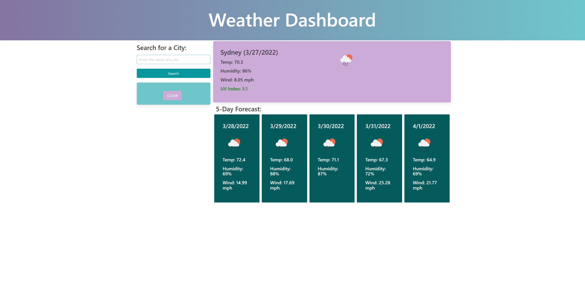
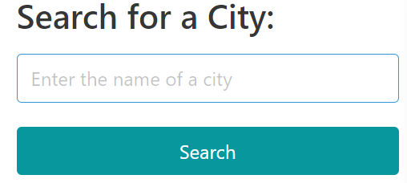
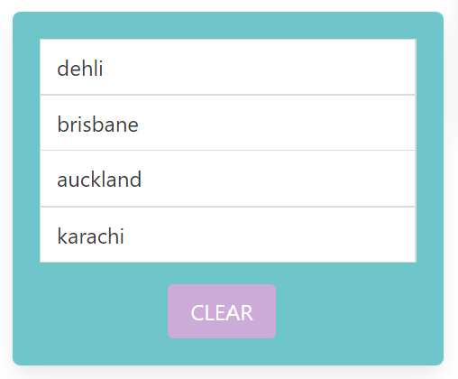
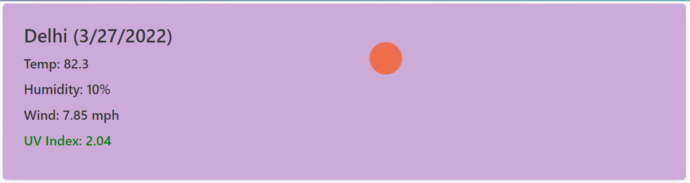
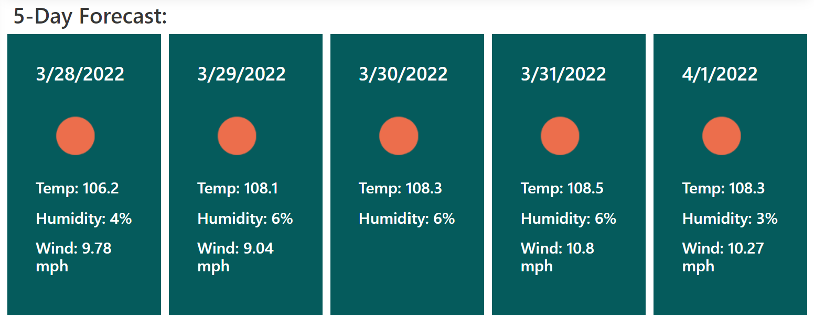

# Weather-Dashboard-by-Jemima-Siddiqui

Homework Assignment for Week 6 by Jemima Siddiqui. 

# 05 About the Project - Weather Dashboard 

The Weather Dashboard application consists of a weather outlook for multiple cities. In this application, a user can input the name of a city and see the weather forcast, including temperature, humidity, wind speed and UV index of that city. They can also see the weather forecast, including temperature, humidity and wind speed of that city for the next 5 days. 



## Acceptance Criteria

The Work Dashboard application fulfills the following acceptance criteria: 
* when a user searches for a city, then they are presented with current and future conditions for that city and that city is added to the search history
* when a user views current weather conditions for that city, then are presented with the city name, the date, an icon representation of weather conditions, the temperature, the humidity, the wind speed, and the UV index
* when a user views the UV index, they are presented with a color that indicates whether the conditions are favorable, moderate, or severe
* when a user views future weather conditions for that city, then they are presented with a 5-day forecast that displays the date, an icon representation of weather conditions, the temperature, the wind speed, and the humidity
* when a user clicks on a city in the search history, then they are presented with current and future conditions for that city

## Installation

### Viewing the homepage 

In order to access the  Weather Dashboard application, navigate to the following link: 
 [Weather Dashboard page](https://jemimasiddiqui.github.io/Weather-Dashboard-by-Jemima-Siddiqui/). 

### Downloading Visual Studio Code 

 Download the latest version of Visual Studio to your local machine (Mac, Linux or Windows). Please use the following link to download the latest version of VS Code [Download VS Code](https://code.visualstudio.com/download). 

### Pulling the repository from Git 

If you would like to acess the source code (HTML, CSS and JavaScript files), please navigate to the following public Github repository [Github Repository](https://github.com/JemimaSiddiqui/Weather-Dashboard-by-Jemima-Siddiqui.git). 

* Clone the repository to your local desktop using the following steps:

  * 🔑 Use the terminal command `cd` to navigate to the directory where we want the repository located. In this case, we will save it to the Desktop. 

  ```bash
  cd Desktop
  ```

  * 🔑 Use the git command `git clone` followed by the URL copied from Github to clone the repo to our local machine.

  ```bash
  git clone <url>
  ```

  * 🔑 Use the `git clone` command creates a new directory with the same name as the repository. We navigate into our new directory using `cd`.

  ```bash
  cd Weather-Dashboard-by-Jemima-Siddiqui
  ```
* After the repository has been cloned to your local machine, open the HTML, CSS and JavaScript files using Visual Studio application. 

## Usage 

This section contains instructions on how to use the Work Day Scheduler Application. 

1. Application page: 

The main page of the application consists of a weather dashboard with an input field for the city name, and cards for the current weather condition and weather forecast for the next 5 days. 


2. Input field and search button:

The user can input the name of a city of their choice and click "Search" to see the weather forcast associated with the selected city. 



3. List of recently searched cities:

There is also a list which stores and displays all the recently searched cities. The user can also click on one of the cities in the list to see the weather forecast associated with that city. They can also click on the "Clear" button to clear the list. 



4. Main weather card: 

The main weather card shows the current weather condition of the city selected by the user. This includes the current temperature, humidity, wind and UV index of that city. 



5. Weather forecast for the next 5 days: 

There are 5 sub-cards which show the weather forecast for the selected city for the next 5 days. This includes the temperature, humidity and wind speed associated with the selected city. 



## Credits

* This README.md file was created through the help of the following tutorial: [Professional README Guide](https://coding-boot-camp.github.io/full-stack/github/professional-readme-guide).

## Main Features

* This webpage consists of the following features: 
  * A user can input a city name of their choice 
  * The searched cities are saved in list displayed on the screen. This list can also be cleared, or a user can click on the name of a city in the list to view the associated weather forecast. 
  * A main card displaying the current weather condition associated with the selected city 
  * Sub-cards showing the 5 day weather forecast of the selected city
---
© 2022 Trilogy Education Services, LLC, a 2U, Inc. brand. Confidential and Proprietary. All Rights Reserved.

